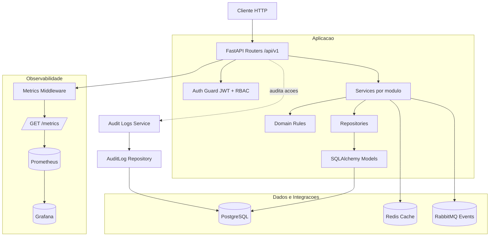
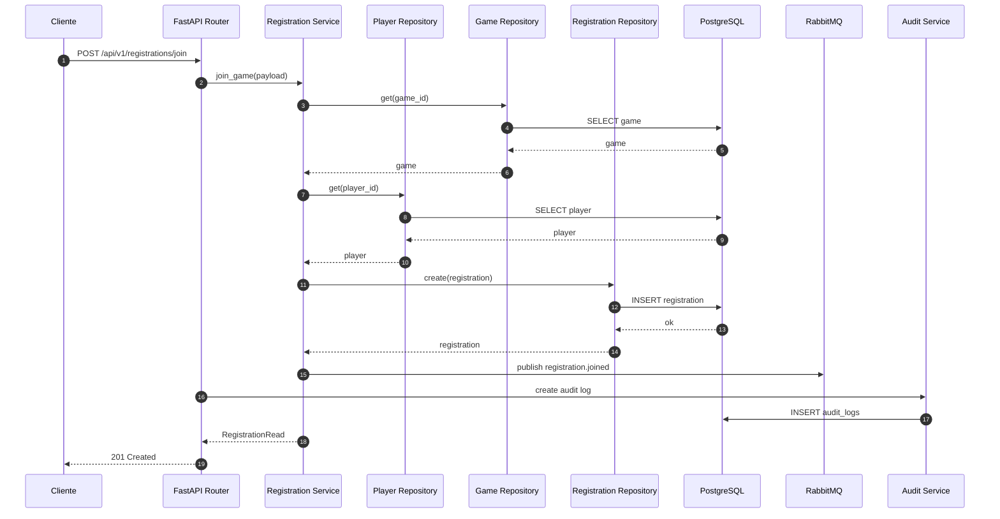
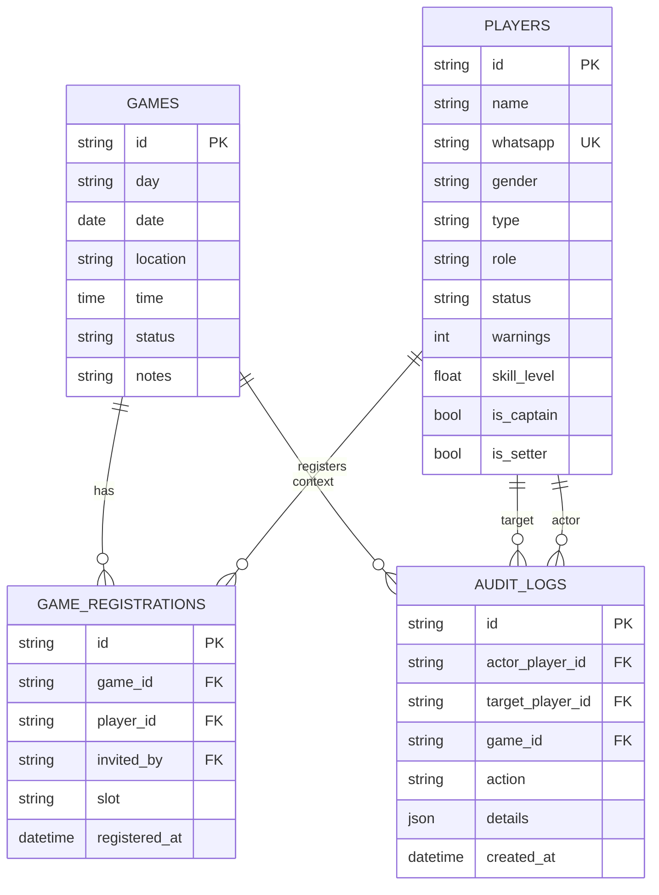

# Conecta Volei Backend Lab

Backend modular para gestão de treinos e jogos de vôlei com foco em:

- cadastro e autenticação de jogadores;
- criação e gestão de jogos (quarta/domingo);
- inscrições com regras de fila principal, waitlist e convidados;
- trilha de auditoria;
- observabilidade com métricas Prometheus.

A API foi construída com FastAPI, SQLAlchemy, Alembic, Redis, RabbitMQ e PostgreSQL, com execução local ou via Docker Compose.

## Sumário

- [Visão Geral](#visão-geral)
- [Stack Tecnológica](#stack-tecnológica)
- [Arquitetura](#arquitetura)
- [Domínio e Regras de Negócio](#domínio-e-regras-de-negócio)
- [Funcionalidades da API](#funcionalidades-da-api)
- [Modelo de Dados](#modelo-de-dados)
- [Estrutura de Pastas](#estrutura-de-pastas)
- [Configuração e Variáveis de Ambiente](#configuração-e-variáveis-de-ambiente)
- [Como Rodar](#como-rodar)
- [Migrações de Banco](#migrações-de-banco)
- [Observabilidade](#observabilidade)
- [Testes](#testes)
- [Seed de Dados de Demonstração](#seed-de-dados-de-demonstração)
- [Limitações Atuais e Próximos Passos](#limitações-atuais-e-próximos-passos)

## Visão Geral

O projeto segue uma arquitetura modular por domínio. Cada módulo encapsula modelo, schemas, repositório e serviço, reduzindo acoplamento e facilitando evolução.

Principais capacidades implementadas:

- autenticação por WhatsApp com token JWT (Bearer);
- RBAC por papel (`player`, `admin`, `super_admin`);
- gerenciamento de jogadores com warnings e mudança automática de status;
- gerenciamento de jogos com validação de dia permitido;
- inscrições em jogos com promoção automática da waitlist;
- tratamento especial de convidados em janela específica;
- trilha de auditoria para ações críticas;
- métricas HTTP para Prometheus.

Prefixo base da API: `/api/v1`

Documentação interativa (FastAPI):

- Swagger UI: `http://localhost:8000/docs`
- ReDoc: `http://localhost:8000/redoc`

## Stack Tecnológica

- Linguagem: Python 3.12+
- API: FastAPI
- Servidor ASGI: Uvicorn
- ORM: SQLAlchemy 2.x
- Migrações: Alembic
- Banco relacional: PostgreSQL
- Cache: Redis
- Mensageria: RabbitMQ (fila `registration_events`)
- Observabilidade: Prometheus Client + Prometheus + Grafana
- Testes: Pytest + HTTPX
- Qualidade: Ruff

## Arquitetura (camadas + fluxo)

### Diagrama de camadas (modular + infraestrutura)



### Fluxo de requisicao (exemplo: inscricao em jogo)



Autenticação e RBAC são aplicados apenas nas rotas protegidas, como warnings, remoção de jogadores, processamento de convidados e consulta de audit logs.

### Responsabilidades por pacote

- `app/api`: camada HTTP (roteamento, validação de entrada/saída, códigos de resposta).
- `app/modules/*/service.py`: regras de aplicação e orquestração de casos de uso.
- `app/modules/*/repository.py`: acesso a dados e queries.
- `app/modules/*/model.py`: entidades ORM.
- `app/modules/*/schemas.py`: contratos Pydantic.
- `app/domain`: regras de domínio puras (constantes, regras de jogo, regras de jogador, sorteio de times).
- `app/core`: infraestrutura transversal (configuração, banco, cache, segurança JWT, mensageria, métricas, handlers de erro).

## Domínio e Regras de Negócio

### Jogadores

- Status calculado por warnings:
  - 0-1 warning: `active`
  - 2 warnings: `penalized`
  - 3+ warnings: `blocked`
- Jogador `blocked` não pode se inscrever em jogos.

### Jogos

- Um jogo só pode ser criado para:
  - quarta-feira (`wednesday`)
  - domingo (`sunday`)
- O ID do jogo é determinístico: `{day}-{yyyy-mm-dd}`
  - exemplo: `sunday-2026-07-05`

### Inscrições

- Capacidade da lista principal: 21 jogadores.
- Regras de slot:
  - jogador `penalized` entra direto em `waitlist`;
  - se houver vaga, entra em `main`;
  - sem vaga, entra em `waitlist`.
- Ao sair um jogador da lista principal, o primeiro da waitlist é promovido automaticamente.
- Convidados (`guest`) com `invited_by` durante janela de quinta/sexta entram em `guests` e podem ser processados depois via endpoint administrativo.

## Funcionalidades da API

Autenticação exigida usa `Authorization: Bearer <token>`.

| Método | Rota                                               | Descrição                                  | Auth  |
| ------ | -------------------------------------------------- | ------------------------------------------ | ----- |
| GET    | `/api/v1/health`                                   | Health check simples                       | Não   |
| GET    | `/api/v1/ready`                                    | Readiness check (DB + cache)               | Não   |
| POST   | `/api/v1/auth/login`                               | Login por WhatsApp e emissão de JWT        | Não   |
| GET    | `/api/v1/auth/me`                                  | Retorna jogador autenticado                | Sim   |
| GET    | `/api/v1/players`                                  | Lista jogadores                            | Não   |
| GET    | `/api/v1/players/{player_id}`                      | Busca jogador por ID                       | Não   |
| POST   | `/api/v1/players`                                  | Cria jogador                               | Não   |
| PATCH  | `/api/v1/players/{player_id}`                      | Atualiza jogador                           | Não   |
| DELETE | `/api/v1/players/{player_id}`                      | Remove jogador                             | Admin |
| POST   | `/api/v1/players/{player_id}/warnings`             | Adiciona warning                           | Admin |
| DELETE | `/api/v1/players/{player_id}/warnings`             | Remove warning                             | Admin |
| POST   | `/api/v1/players/{player_id}/warnings/reset`       | Zera warnings                              | Admin |
| GET    | `/api/v1/games`                                    | Lista jogos (com cache)                    | Não   |
| GET    | `/api/v1/games/{game_id}`                          | Busca jogo por ID                          | Não   |
| POST   | `/api/v1/games`                                    | Cria jogo                                  | Não   |
| PATCH  | `/api/v1/games/{game_id}`                          | Atualiza jogo                              | Não   |
| DELETE | `/api/v1/games/{game_id}`                          | Remove jogo                                | Não   |
| GET    | `/api/v1/registrations?game_id=...`                | Lista inscrições por jogo                  | Não   |
| POST   | `/api/v1/registrations/join`                       | Inscreve jogador no jogo                   | Não   |
| POST   | `/api/v1/registrations/leave`                      | Remove inscrição do jogo                   | Não   |
| POST   | `/api/v1/registrations/process-guests?game_id=...` | Processa fila de convidados                | Admin |
| GET    | `/api/v1/audit-logs`                               | Lista logs de auditoria                    | Admin |
| GET    | `/api/v1/teams`                                    | Endpoint placeholder (retorna lista vazia) | Não   |
| GET    | `/metrics`                                         | Métricas Prometheus                        | Não   |

## Modelo de Dados



## Estrutura de Pastas

```text
app/
  api/
    router.py
    v1/
      auth.py
      players.py
      games.py
      registrations.py
      audit_logs.py
      system.py
      teams.py
  core/
    config.py
    database.py
    cache.py
    messaging.py
    security.py
    metrics.py
    errors.py
  domain/
    constants.py
    player_rules.py
    game_rules.py
    team_draw.py
  modules/
    auth/
    players/
    games/
    registrations/
    audit_logs/

tests/
alembic/
observability/
scripts/
```

## Configuração e Variáveis de Ambiente

Use `.env` (há um template em `.env.example`).

Variáveis principais:

- `APP_NAME`: nome da aplicação.
- `ENVIRONMENT`: ambiente (`local`, etc).
- `DEBUG`: habilita modo debug.
- `DATABASE_URL`: URL SQLAlchemy para PostgreSQL.
- `REDIS_URL`: URL do Redis.
- `RABBITMQ_URL`: URL AMQP do RabbitMQ.
- `JWT_SECRET_KEY`: segredo para assinatura do token JWT.
- `JWT_ACCESS_TOKEN_EXPIRE_MINUTES`: expiração do token em minutos.
- `TEST_DATABASE_URL`: banco para suíte de testes.

## Como Rodar

### 1) Rodando local (sem Docker para API)

Pré-requisitos:

- Python 3.12+
- PostgreSQL
- Redis
- RabbitMQ

Passos (Linux/macOS):

```bash
cp .env.example .env
pip install -e .[dev]
alembic upgrade head
uvicorn app.main:app --reload --host 0.0.0.0 --port 8000
```

Passos (Windows PowerShell):

```powershell
Copy-Item .env.example .env
.\.venv\Scripts\python.exe -m pip install -e ".[dev]"
.\.venv\Scripts\alembic.exe upgrade head
.\.venv\Scripts\python.exe -m uvicorn app.main:app --reload --host 0.0.0.0 --port 8000
```

API disponível em: `http://localhost:8000`

### 2) Rodando com Docker Compose (stack completa)

```bash
docker compose up --build
```

Fluxo mais usado no projeto (subindo apenas a API em background):

```bash
docker compose up -d --build api
```

Esse comando sobe a API e os serviços dependentes definidos no Compose.

Serviços expostos:

- API: `http://localhost:8000`
- PostgreSQL: `localhost:5433`
- Redis: `localhost:6379`
- RabbitMQ AMQP: `localhost:5672`
- RabbitMQ Management: `http://localhost:15672`
- Prometheus: `http://localhost:9090`
- Grafana: `http://localhost:3000`

Observação: o container da API executa `alembic upgrade head` automaticamente no startup.

## Migrações de Banco

Histórico atual de migrations Alembic:

- `4ab5bc9c79da`: cria tabela `players`.
- `49d804a86c37`: cria tabela `games`.
- `d545fcee814f`: cria tabela `game_registrations`.
- `a1f2b3c4d5e6`: adiciona coluna `role` em `players`.
- `b2c3d4e5f6a7`: cria tabela `audit_logs`.

Comandos úteis:

```bash
alembic upgrade head
alembic downgrade -1
alembic revision --autogenerate -m "descricao da mudanca"
```

## Observabilidade

- Endpoint de métricas: `GET /metrics`
- Métricas instrumentadas:
  - `http_request_total`
  - `http_request_duration_seconds`
- `observability/prometheus.yml` já contém scrape da API.
- Grafana pode ser conectado ao Prometheus para dashboards.

## Testes

Rodar suíte completa:

```bash
pytest -q
```

No Windows PowerShell:

```powershell
.\.venv\Scripts\python.exe -m ruff check .
.\.venv\Scripts\python.exe -m pytest
```

Cobertura funcional existente inclui:

- health e readiness;
- autenticação e endpoint `/auth/me`;
- CRUD de players/games;
- regras de warning/status;
- fluxo de inscrições (main/waitlist/guests);
- auditoria de eventos;
- configurações de Dockerfile, compose e métricas.

## Seed de Dados de Demonstração

Para popular dados de exemplo:

```bash
python -m scripts.seed_demo
```

No Windows PowerShell:

```powershell
.\.venv\Scripts\python.exe scripts\seed_demo.py
```

O seed cria:

- jogo de domingo de demonstração;
- 21 membros na lista principal;
- 1 jogador em waitlist;
- 1 convidado em `guests`;
- 1 jogador penalizado;
- 1 jogador bloqueado.

## Limitações Atuais e Próximos Passos

Este projeto é um backend lab em evolução. Alguns pontos foram mantidos intencionalmente simples para priorizar clareza arquitetural, cobertura de testes e demonstração das regras de negócio principais.

- O módulo de sorteio de times já possui regras de domínio testadas, mas o endpoint `/api/v1/teams` ainda pode evoluir para expor o fluxo completo via API.
- O projeto publica eventos de inscrição no RabbitMQ, mas ainda não implementa um consumidor dedicado para processamento assíncrono.
- A autenticação JWT e o RBAC já existem, mas algumas rotas podem receber políticas mais restritivas conforme uma definição final de produto, especialmente operações administrativas de jogos e cadastros.
- O projeto ainda pode evoluir com versionamento semântico, changelog e pipeline CI/CD completo.

---
